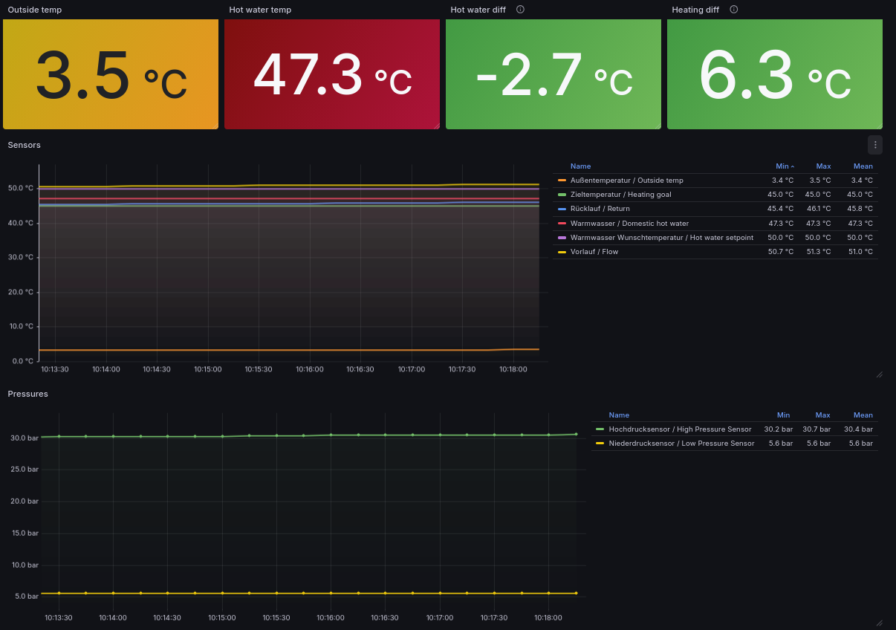

# dimplex-pcoweb-exporter

Prometheus exporter for Glen Dimplex heat pumps (heavily modified fork of https://github.com/tgulacsi/pcoweb-client).

This client, in combination with a Prometheus and Grafana instance, can be used to monitor and visualize the metrics of a Glen Dimplex heat pump - effectively obsoleting the need for the "Graphical device data" "Premium" features of the "Dimplex Home" app (saving you the 9,99€/year).

## Installation

```shell
$ make help

Usage:
  make <target>

Help
  help             Display this help.

Build
  build-linux      Build binary for Linux
  build-armv7      Build binary for ARMv7 architecture
  build-arm64      Build binary for ARM64 architecture
```

## Usage

```shell
Usage of dimplex-pcoweb-exporter:
      --host string           modbus host to connect to
      --metrics-port string   metrics address to listen on (default ":9112")
```

## Metrics

Below values are (roughly mapped, errors not to be ruled out) taken from `https://pcoweb-address/config/adminpage.html` and `https://pcoweb-address/http/`.
For now, only analog variables are read from the client.

All metrics are prefixed with `glendimplex_`, following the respective subsystem (`analog_` for analog variables, `integer_` for integer variables, ...).

<details>

<summary>Analog Variables</summary>

Analog variables are read from the _Holding Register_, as per [documentation](https://dimplex.atlassian.net/wiki/spaces/DW/pages/3303571457/Modbus+TCP+Anbindung#4-Unterst%C3%BCtze-Funktionscodes).

| Analogue Bit | Name                              | Metric name |
|--------------|-----------------------------------|-------------|
| 1            | Outside Temperature               |glendimplex_analog_outside_temperature|
| 2            | Return / House Temperature        |glendimplex_analog_return_temperature|
| 3            | Hot Water Temperature             |glendimplex_analog_hot_water_temperature|
| 5            | Flow (in)                         |glendimplex_analog_flow_in_temperature|
| 8            | High-Pressure Sensor (bar)        |glendimplex_analog_high_pressure_sensor_bar|
| 29           | Heating Setpoint (first circuit)  |glendimplex_analog_heating_setpoint|
| 53           | Heating Goal Temperature          |glendimplex_analog_heating_goal_temperature|
| 54           | Heating Setpoint (second circuit) |glendimplex_analog_heating_setpoint2|
| 55           | Heating Setpoint (third circuit)  |glendimplex_analog_heating_setpoint3|
| 58           | Hot Water Setpoint                |glendimplex_analog_hot_water_setpoint|
| 71           | Additional Pump (Operating Hours) |glendimplex_analog_additional_pump_operating_hours|
| 72           | Compressor 1 (Operating Hours)    |glendimplex_analog_compressor1_operating_hours|
| 73           | Compressor 2 (Operating Hours)    |glendimplex_analog_compressor2_operating_hours|
| 74           | Fan (Operating Hours)             |glendimplex_analog_fan_operating_hours|
| 75           | Second Heater (Operating Hours)   |glendimplex_analog_second_heater_operating_hours|
| 76           | Heating Pump (Operating Hours)    |glendimplex_analog_heating_pump_operating_hours|
| 77           | Hot Water Pump (Operating Hours)  |glendimplex_analog_hot_water_pump_operating_hours|
| 78           | Flange Heater (Operating Hours)   |glendimplex_analog_flange_heater_operating_hours|
| 96           | [Heating Power Level](https://dimplex.atlassian.net/wiki/x/toLox)|glendimplex_analog_heating_power_level|
| 101          | Low-Pressure Sensor (bar)         |glendimplex_analog_low_pressure_sensor_bar|

</details>

<details>

<summary>Integer Variables</summary>

| Integer Bit | Name                             | Description |
|-------------|----------------------------------|-------------|
| 95          | Generated Heat (kWh)             |             |
| 1660        | Total Generated Heat (kWh)       |             |
| 1663        | Total Heating (kWh)              |             |
| 1675        | Heating (kWh)                    |             |
| 1681        | Hot Water (kWh)                  |             |
| 1669        | Total Hot Water (kWh)            |             |
| 1647        | Environmental Energy (kWh)       |             |
| 1644        | Total Environmental Energy (kWh) |             |

</details>

### Grafana Dashboard

In the `./grafana` directory, you can find a `dashboard.json` file showing the heat pump's metrics.


